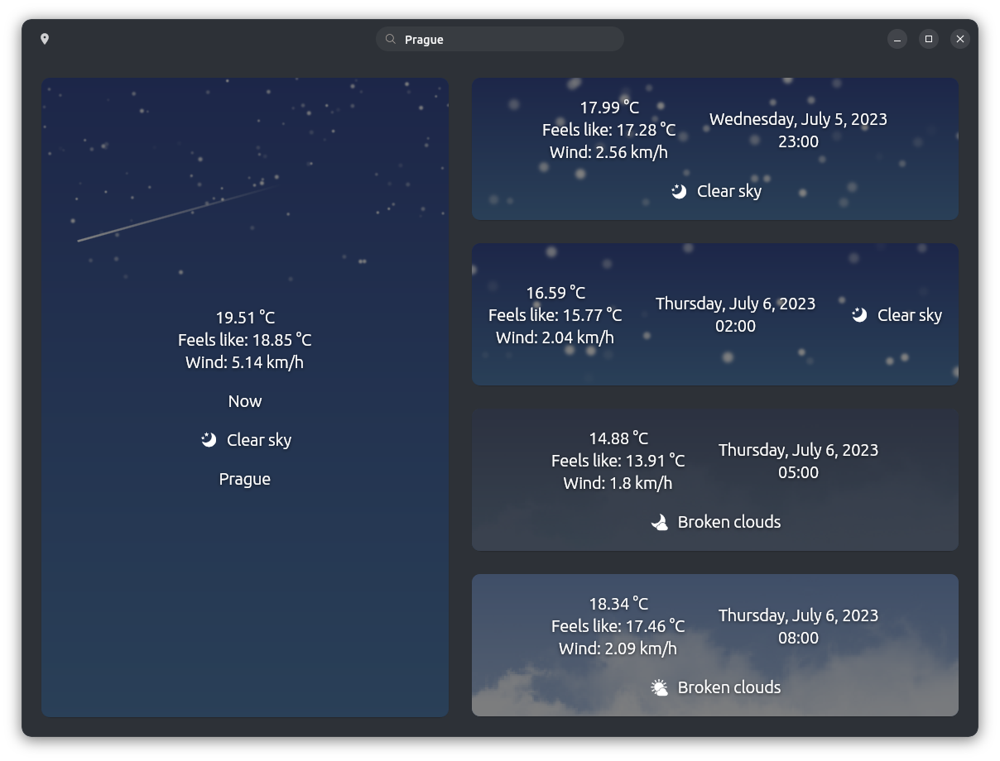

# Pulse - weather and news app for Ubuntu Desktop




## Build

### Install Flutter

<details>
<summary>Ubuntu</summary>

Copy & paste this into your terminal, press enter, then enter your password and wait:

```
sudo apt -y install git curl cmake meson make clang libgtk-3-dev pkg-config && mkdir -p ~/development && cd ~/development && git clone https://github.com/flutter/flutter.git -b stable && echo 'export PATH="$PATH:$HOME/development/flutter/bin"' >> ~/.bashrc && source ~/.bashrc
```

</details>

<br>


### Api Key

Requires an api key from [openweathermap](https://openweathermap.org) which you need to create yourself (free tier) in your own account. If you did, create the file `apikey.json` under `/assets/` and add your api key as the value of the property `apiKey`.

```json
{
    "apiKey": "YOUR_API_KEY_HERE"
}
```